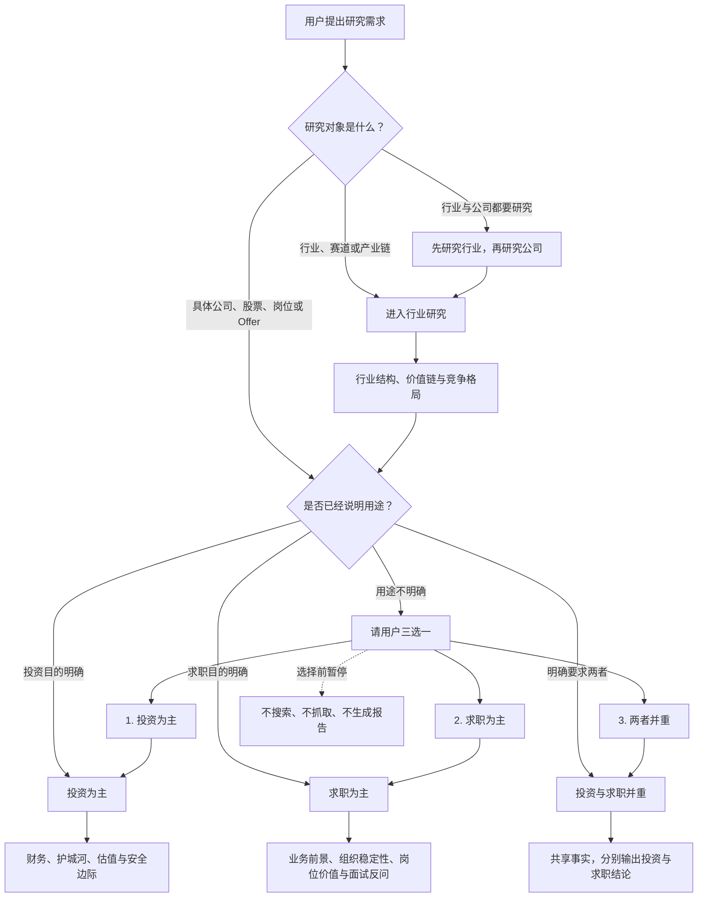
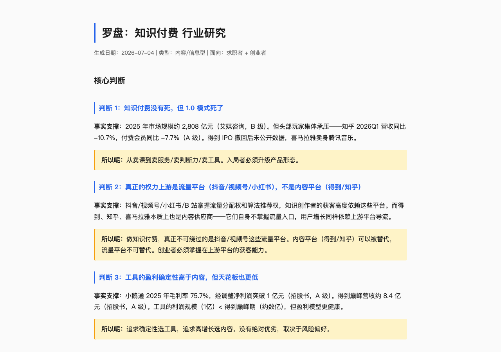
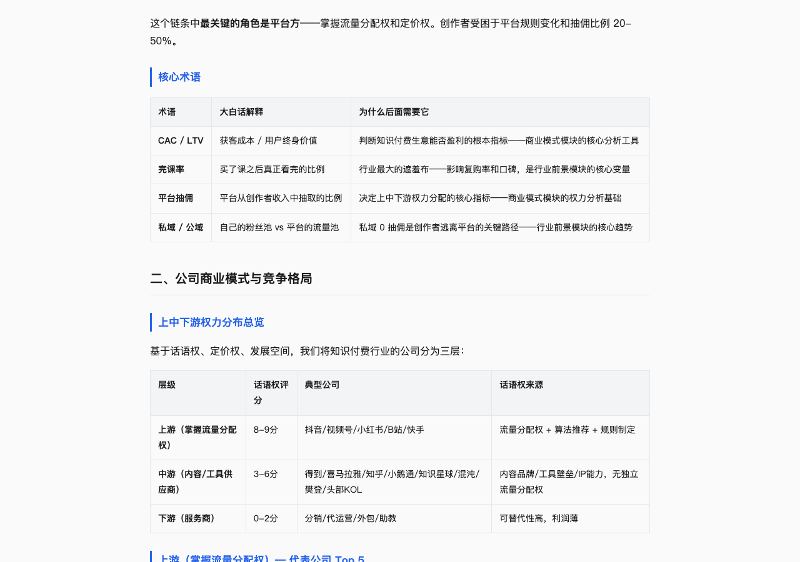
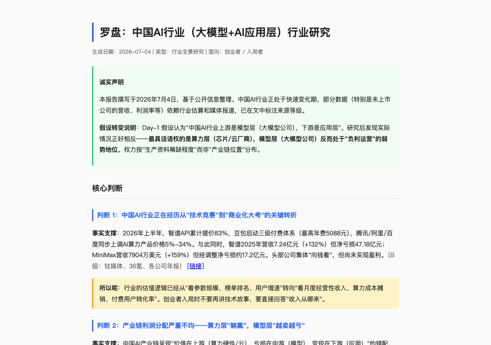
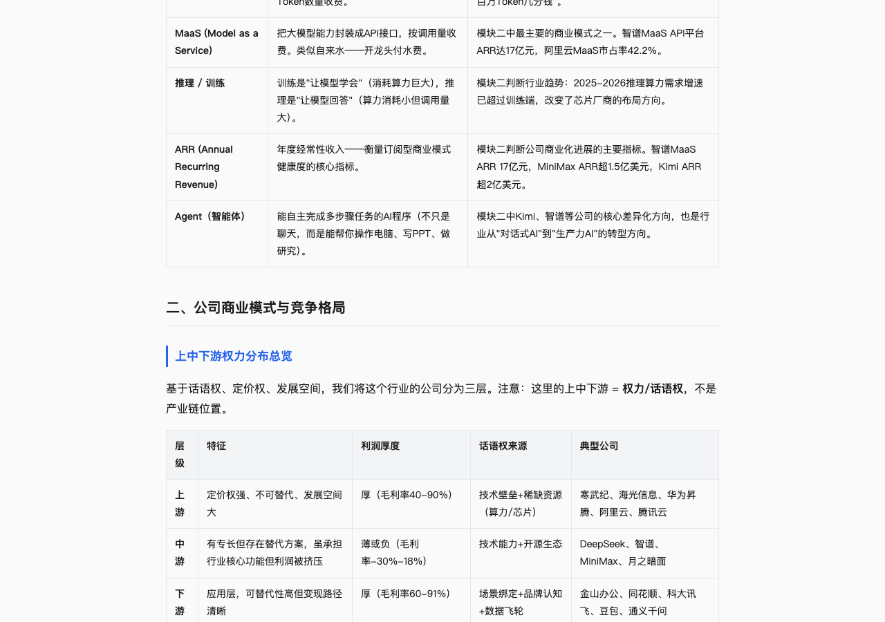
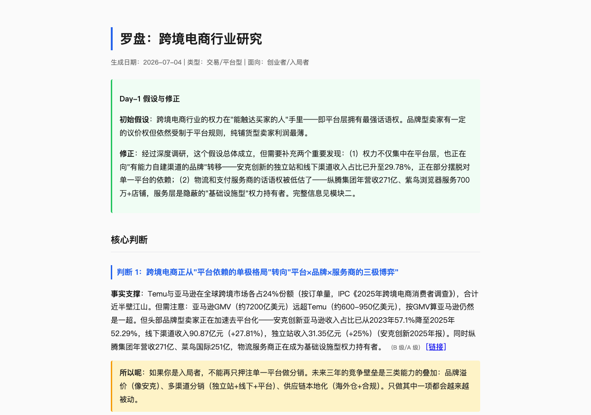
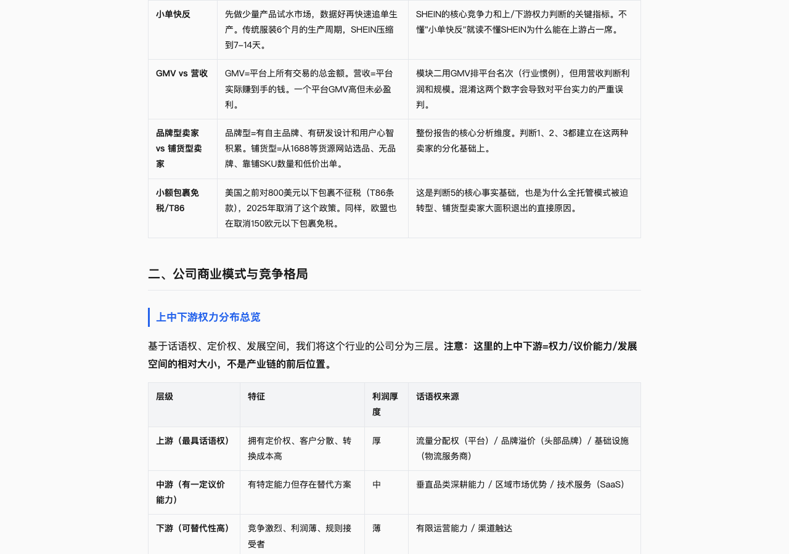
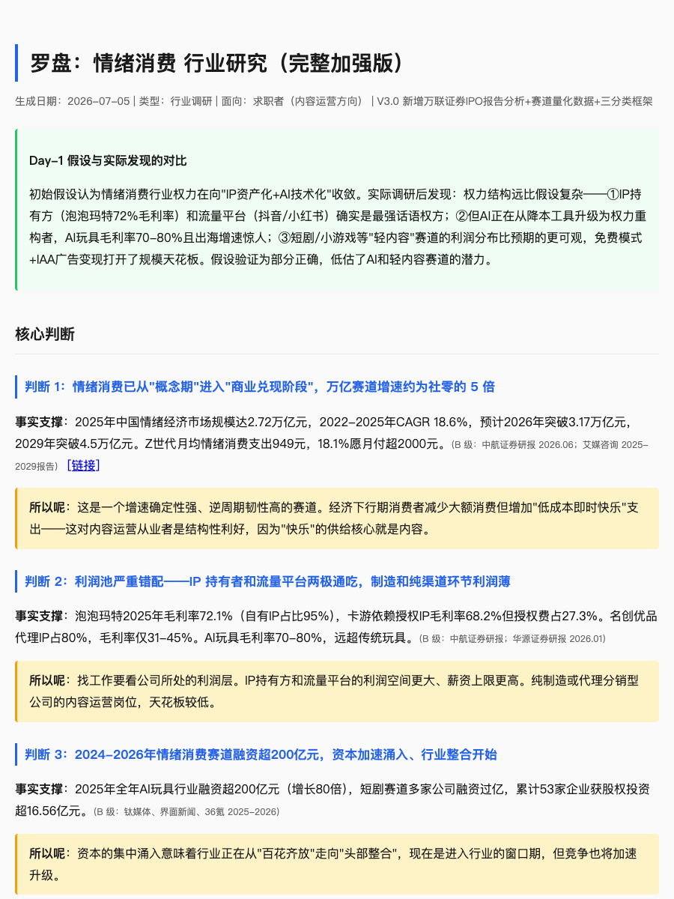
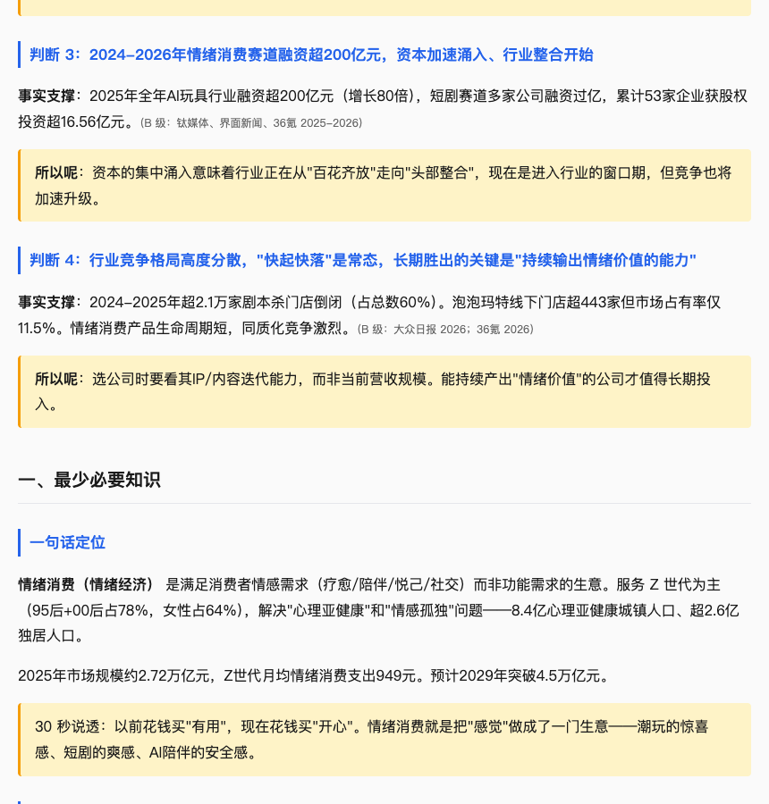

# 罗盘（luopan）— 行业研究 + 公司研究路由器

> **不输出百科，输出判断。**
>
> 输入一个行业，帮你看清钱、权力和机会；输入一家公司，先确认投资或求职目的，再判断它是否值得买、值得去。
>
> 底层逻辑包括：信源分级（A/B/C）+ 多源视角矩阵 + 对抗验证 + 诚实原则。

---

## 这个仓库包含什么

罗盘不是两个互不相干的 Skill，而是一个带路由的研究系统：

| 部分 | 位置 | 作用 |
|------|------|------|
| **统一入口与路由器** | [`SKILL.md`](SKILL.md) | 判断用户研究的是行业还是公司，并加载对应子 Skill |
| **行业研究** | [`modes/industry/SKILL.md`](modes/industry/SKILL.md) | 研究行业结构、产业链权力、公司格局、利润分布和进入机会 |
| **公司研究** | [`modes/company/SKILL.md`](modes/company/SKILL.md) | 研究公司发展、商业模式和生态位，并按用户选择运行投资判断、求职判断或双线判断 |

```text
罗盘 SKILL.md
├── 行业、赛道、产业链 → 行业研究 Skill
└── 具体公司、股票、岗位 → 公司研究 Skill
    ├── 投资为主
    ├── 求职为主
    └── 投资与求职并重
```

行业和公司研究共享信源分级、对抗验证与诚实原则，但使用不同的判断模型。用户只需要安装整个仓库、调用“罗盘”，不需要分别寻找两个 Skill。

---

## 一句话开始使用

```text
研究行业：帮我研究一下 AI Agent 行业
研究投资：从投资角度研究一下 NVIDIA
研究求职：我准备面试字节跳动，帮我判断是否值得去
用途不明：帮我调研一下腾讯 → 罗盘会请你选择投资、求职或两者并重
组合研究：先研究游戏行业，再看腾讯在行业中的位置
```

罗盘的根 `SKILL.md` 只负责路由，完整方法分别位于：

- [`modes/industry/SKILL.md`](modes/industry/SKILL.md)：行业结构、价值链、竞争格局和进入机会；
- [`modes/company/SKILL.md`](modes/company/SKILL.md)：公司发展、投资价值和求职价值。

---

## 两种研究模式

| 用户需求 | 罗盘如何处理 | 主要回答的问题 |
|----------|--------------|----------------|
| **行业研究** | 直接进入行业研究流程 | 行业怎么运转、谁掌握话语权、利润在哪里、是否值得进入 |
| **公司研究** | 路由到公司研究子 Skill | 公司怎么赚钱、发展质量如何、是否值得投资或加入 |

当用户只说“帮我调研一下这家公司”，但没有说明用途时，罗盘会先询问一次：

1. **投资为主**——重点研究财务质量、商业模式、护城河、管理层、估值与安全边际。
2. **求职为主**——重点研究业务前景、组织稳定性、岗位价值、职业杠杆与面试反问。
3. **投资与求职并重**——只有用户明确选择后，才同时展开两条判断线。

这样做是为了避免让求职用户阅读大段估值，也避免让投资用户被岗位信息干扰。用途明确后再调研，不靠公司类型替用户猜测。

---

## 罗盘如何路由你的研究需求

罗盘不是只有行业调研。它先判断你研究的是“行业”还是“公司”，再加载对应的方法；公司研究还会确认你真正要解决的是投资还是求职问题。



### 你可以直接这样使用

| 你怎么问 | 罗盘怎么走 |
|----------|------------|
| “研究一下 AI Agent 行业” | 直接进入行业研究 |
| “英伟达现在值得买吗？” | 直接进入公司投资研究 |
| “我准备面试字节跳动” | 直接进入公司求职研究 |
| “帮我调研一下腾讯” | 先请你选择投资、求职或两者并重 |
| “先研究游戏行业，再看腾讯” | 先建立行业地图，再进入公司研究 |

公司研究先确认用途，不是增加问卷。投资者和求职者关心的并不是同一件事：前者需要判断现金流、估值和安全边际，后者需要判断业务位置、团队风险和职业资本。只追问一次，可以避免报告写完后因方向错误而推倒重来。

---

## 公司研究示例

### 三个真实案例：同一个入口，三种不同输出

#### Case 1：NVIDIA，选择“投资为主”

**用户这样问：**

> 帮我调研一下 NVIDIA，我主要想判断是否值得投资。

**罗盘怎么做：**

- 判断 NVIDIA 如何从芯片供应商变成 AI 计算平台；
- 检查 CUDA、网络互联和全栈系统形成的护城河；
- 分析收入、利润、自由现金流和增长质量；
- 用悲观、基准、乐观三种情景估值；
- 反推当前价格隐含的增长要求；
- 按目标回报率计算留有安全边际的“好价格”。

**点醒结论：**

> 好公司不等于当前是好价格。

报告认为 NVIDIA 的公司质量通过，但基准日约 210.96 美元的价格，要求未来五年正常化现金流仍保持约 31%–32%年增长，当前价格没有通过安全边际测试。

**下一步可以追问：**目标年化回报率为8%、10%和12%时，合理价格分别是多少？云厂商削减资本开支会怎样影响 NVIDIA？

#### Case 2：字节跳动，选择“求职为主”

**用户这样问：**

> 我准备面试字节跳动，帮我看看这家公司是否值得去。

用户已经说明求职目的，因此罗盘不再询问，直接进入求职路线。

**罗盘怎么做：**

- 判断公司和目标业务是否稳定；
- 区分核心增长、现金牛、战略试验与边缘收缩业务；
- 检查岗位能否积累可证明、可迁移的成果；
- 识别直属上级、团队稳定性和组织变化风险；
- 给出10个自然、低防御的面试反问。

字节跳动是非上市公司。报告不会使用媒体估算拼出看似精确的营收、利润和估值模型。

**点醒结论：**

> 值得面试，不等于值得接受 Offer。

字节的平台规模、全球业务和 AI 投入能够提供高密度职业资本，但具体岗位是否值得加入，取决于业务位置、直属上级、成果所有权和个人目标，而不是“字节经历”四个字。

**下一步可以追问：**把具体 JD、职级和薪酬发给罗盘，或者把不同面试官的回答发来，升级为业务级或 Offer 级判断。

#### Case 3：腾讯，明确选择“投资与求职并重”

**用户这样问：**

> 帮我调研一下腾讯，我既想看投资机会，也想判断是否值得去工作。

罗盘只建立一次公司身份、财务、商业模式和生态位事实底座，然后分别运行投资与求职判断，不把二者混成一个总分。

**投资线重点：**微信、游戏、广告、支付和企业服务如何共同变现；收入、利润与自由现金流质量；AI投入与监管风险；三情景估值和安全边际。

**求职线重点：**公司与业务稳定性；具体事业群的位置；岗位是否拥有资源、决策空间和可归因成果；如何通过自然反问判断团队真实情况。

**点醒结论：**

> 同一家公司的投资结论和求职结论，可以完全不同。

腾讯的公司质量可取，但基准日约590.5港元更接近合理价格，尚未留出足够安全边际；从求职角度看，公司级值得继续了解，但腾讯内部业务线之间的差异，可能比腾讯与其他公司的品牌差异更重要。

**下一步可以追问：**腾讯降到什么价格才满足安全边际？某个具体事业群是增长业务还是成熟业务？带上 JD 后是否值得接受 Offer？

### 查看三个案例的完整结果

HTML 是在线预览版，点开就是报告页面；Markdown 和 JSON 是源文件，适合查看结构和留档。

| 公司 | 默认展示案例 | 报告 |
|------|--------------|------|
| **NVIDIA（英伟达）** | 投资主线：公司质量、情景估值、反向估值与安全边际 | [HTML 在线预览](https://zhangxiaoqiang1991.github.io/luopan/review-output/NVIDIA-%E5%85%AC%E5%8F%B8%E8%B0%83%E7%A0%94-2026-07-12.html) · [Markdown](review-output/NVIDIA-%E5%85%AC%E5%8F%B8%E8%B0%83%E7%A0%94-2026-07-12.md) · [JSON](review-output/NVIDIA-%E5%85%AC%E5%8F%B8%E8%B0%83%E7%A0%94-2026-07-12.json) |
| **字节跳动** | 求职主线：公司级初筛、风险边界与10个低防御面试反问 | [HTML 在线预览](https://zhangxiaoqiang1991.github.io/luopan/review-output/%E5%AD%97%E8%8A%82%E8%B7%B3%E5%8A%A8-%E5%85%AC%E5%8F%B8%E8%B0%83%E7%A0%94-2026-07-12.html) · [Markdown](review-output/%E5%AD%97%E8%8A%82%E8%B7%B3%E5%8A%A8-%E5%85%AC%E5%8F%B8%E8%B0%83%E7%A0%94-2026-07-12.md) · [JSON](review-output/%E5%AD%97%E8%8A%82%E8%B7%B3%E5%8A%A8-%E5%85%AC%E5%8F%B8%E8%B0%83%E7%A0%94-2026-07-12.json) |
| **腾讯控股** | 投资与求职双线示例：两类结论分别呈现 | [HTML 在线预览](https://zhangxiaoqiang1991.github.io/luopan/review-output/%E8%85%BE%E8%AE%AF%E6%8E%A7%E8%82%A1-%E5%85%AC%E5%8F%B8%E8%B0%83%E7%A0%94-2026-07-12.html) · [Markdown](review-output/%E8%85%BE%E8%AE%AF%E6%8E%A7%E8%82%A1-%E5%85%AC%E5%8F%B8%E8%B0%83%E7%A0%94-2026-07-12.md) · [JSON](review-output/%E8%85%BE%E8%AE%AF%E6%8E%A7%E8%82%A1-%E5%85%AC%E5%8F%B8%E8%B0%83%E7%A0%94-2026-07-12.json) |

公司研究同时支持上市公司与非上市公司，但证据边界不同：上市公司优先使用监管披露、财报和公告；非上市公司若缺少可靠数据，会明确标注“公开信息有限”，不会用媒体传闻拼出虚假的精确财务结论。

每份正式公司报告使用同一份结构化事实生成三种格式：**HTML 用于阅读展示，Markdown 用于本地保存，JSON 用作可复核的数据底稿。**

---

## 行业研究示例

| 行业 | 报告 | 亮点速览 |
|------|------|---------|
| 📚 **知识付费** | [查看报告](test-output/知识付费-行业研究.html) | **反直觉发现**：权力上游是流量平台（抖音/视频号），不是内容平台（得到/知乎）。工具（小鹅通毛利率75.7%）比内容（得到）盈利更确定。 |
| 🤖 **AI行业（大模型+应用层）** | [查看报告](test-output/AI行业-行业研究.html) | **最反常识**：产业链利润严重错配——卖算力的已盈利（寒武纪+20亿），做模型的巨亏（智谱亏47亿），应用层反而最肥（同花顺毛利率91%）。 |
| 🌐 **跨境电商（中国出口）** | [查看报告](test-output/跨境电商-行业研究.html) | **格局判断**：权力从"平台单极"转向"平台×品牌×服务商三极博弈"。安克创新亚马逊收入占比已降至52%，去平台化正在加速。 |

---

## 截图展示

> 每份报告包含：核心判断（答案先行，数据+来源+"所以呢"）→ 上中下游权力分布（按话语权，非产业链位置）→ 逐家公司分析 → 行业前景 + 行动建议

### 知识付费行业

核心判断 + 上中下游权力分布 + 公司分析




### AI行业（大模型+AI应用层）

核心判断 + 上中下游权力分布 + 公司分析




### 跨境电商（中国跨境出口电商）

核心判断 + 上中下游权力分布 + 公司分析




### 情绪消费（情绪经济）

以下保留该次研究的截图展示；当前仓库未收录对应的完整 HTML 报告。

该研究综合运用中航证券、大象研究院、万联证券三份报告的多源框架，覆盖31家公司、5大赛道内容运营岗位及近三年投资事件。




---

## 在调研中发现的新洞察

以下是在这个项目的调研过程中发现的反直觉判断——它们不是已知常识，而是在结构化调研中"冒出来"的：

| 洞察 | 行业 | 为什么反直觉 |
|------|------|------------|
| **"得到"不是上游，抖音才是** | 知识付费 | 习惯把"内容好"当"权力大"。实际上得自己不掌握流量入口，用户增长依赖上游平台导流。 |
| **小鹅通毛利率75.7% > 得到巅峰营收** | 知识付费 | 工具的盈利确定性远高于内容，但天花板也更低。没有绝对优劣，取决于风险偏好。 |
| **卖算力的赚钱，做模型的巨亏，应用层反而肥** | AI行业 | 违反"产业链上游=最强"的直觉。芯片厂（寒武纪/海光）先盈利了，模型层还在烧钱，应用层（同花顺91%毛利率）闷声发大财。 |
| **紫鸟浏览器在跨境电商中有上游话语权** | 跨境电商 | 一个SaaS工具65%毛利率，服务700万+店铺。表面是工具供应商，实际是谁也离不开的基础设施。 |
| **安克创新正在"去平台化"** | 跨境电商 | 亚马逊收入占比从57%降至52%，独立站+线下渠道在扩建。权力在从平台向强势品牌转移。 |
| **泡泡玛特毛利率72.1%，但市占率仅11.5%** | 情绪消费 | 行业格局极度分散（CR5仅20.8%），但头部利润池极厚。对标日本（CR3=55%），整合空间巨大。 |
| **AI玩具赛道一年融了200亿** | 情绪消费 | 2024年仅2.49亿→2025年飙至200亿（增长80倍）。红杉、阿里、字节全线入局，AI玩具毛利率70-80%远超传统玩具。 |
| **短剧千亿市场，但内容运营岗薪资分化严重** | 情绪消费 | 基层岗4-8K vs 高级岗80-110K/月。出海方向需求最旺，英语+内容是稀缺组合。 |

**这些洞察不是在百度百科上能查到的。它们来自：A/B/C三级信源的交叉验证 + 上中下游权力分析框架的强制追问 + 多源视角矩阵的框架对比。**

---

## 安装方式

```bash
# 克隆仓库
git clone https://github.com/zhangxiaoqiang1991/luopan.git

# 安装时请保留完整目录结构；根 SKILL.md 会继续加载 modes/ 下的子 Skill
```

**支持工具：**

- 国内：Workbuddy / Codebuddy / KimiCode / Trae
- 国外：Claude Code / Codex / OpenClaw

## 底层逻辑

市面上的研究要么太浅（百科式简介），要么太深（券商研报几百页）。你需要快速理解一个陌生行业或公司时，缺的是**一张结构化的地图**——知道钱怎么流动、谁有话语权，以及下一步该不该投入时间或资金。

行业研究路线从麦肯锡行业研究方法论中提取了四个核心机制：

1. **信源分级** — A 级（财报/公告）/ B 级（行业报告/权威媒体）/ C 级（交叉验证，标注未证实）
2. **多源视角矩阵** — 按行业类型（消费/科技/平台/服务/政策）分配6个标准视角（政策/资本/产业链/技术/需求/人才）的权重，不同行业用不同的信息源策略（详见 SKILL.md Phase 0.5）
3. **对抗验证** — 出完初稿换"挑刺者"视角再过一遍
4. **诚实原则** — 交代假设转变、信息局限、矛盾数据（不让"听起来有道理但没数据支撑"的断言混过去）


## 使用方法

在 AI 助手中调用罗盘，说出想研究的行业或公司即可。根 Skill 会先判断研究对象，再路由到对应流程。

**触发词：**

- "帮我了解一下 XX 行业"
- "研究一下 XX 行业"
- "XX 行业入门 / 分析"
- "我想做 XX，帮我看看这个行业值不值得进"
- "帮我调研一下 XX 公司"
- "从投资角度研究一下 XX"
- "我准备面试 XX，帮我看看是否值得去"

行业需求会进入9阶段调研流水线（信源分级→多源视角矩阵→对抗验证→质量自检）。公司需求如果没有说明用途，会先出现“投资为主、求职为主、投资与求职并重”三选一；用户选择后才开始深度研究。完整路由与方法见 [SKILL.md](SKILL.md)，公司研究规则见 [modes/company/SKILL.md](modes/company/SKILL.md)。

**行业研究输出结构：**

```
核心判断 → 3-5 条最重要的结论（答案先行）

一、最少必要知识 → 这个行业是干什么的
   一句话定位 + 运作框架 + 核心术语 + 关键数字

二、公司商业模式与竞争格局 → 钱怎么挣、谁在挣
   上中下游权力分布 + 代表公司（每层 Top N，多视角发现的均纳入）
   每家公司的商业模式 + 关键数据 + 分类理由
   行业状况 + 市场动态 + 竞争格局变化

三、行业前景 → 值不值得进、往哪进
   趋势信号 + 核心风险 + 未解决的争论 + 行动建议
```

**公司研究输出结构：**

```text
共同事实底座 → 公司身份、业务结构、财务与证据边界

投资为主 → 商业模式 → 护城河 → 管理层 → 财务质量 → 风险与反证 → 好价格与安全边际

求职为主 → 业务稳定性 → 组织红利 → 风险穿透 → 职业杠杆 → 面试反问

投资与求职并重 → 共享事实，但分别给出投资结论与求职结论
```

## 注意事项

- 不输出百科，输出判断。每个核心判断必须有数据 + 来源 + "所以呢"
- 上中下游按**权力/话语权**划分，不是产业链位置（这是最容易被误解的地方）
- C 级来源必须标注"未经官方证实"，禁止"业内人士称"等模糊来源
- 每家公司分类必须有分析理由（不能只说"因为是行业第一"）
- 搜不到的数据不编，诚实标注"公开信息有限"
- `通过`只表示某项检查达到当前标准，不等于直接建议买入或接受 Offer
- 公司层面的求职判断只能决定是否值得继续面试；具体 Offer 还需结合岗位、直属上级、团队和个人目标判断
- 投资报告必须把“好公司”和“好价格”分开，价格判断需给出估值假设和安全边际

## 反馈 & 帮助迭代

欢迎在 [Issues](https://github.com/zhangxiaoqiang1991/luopan/issues) 页面提交反馈，或直接联系作者。

## 关于我

**大厂转型人强哥**（全网同名）

河北邯郸人，曾武汉求学，现居北京。曾就职腾讯、字节跳动。目前负责 AI + 内容增长、产品运营。关注以下三方面的机会，欢迎交流 / 围观朋友圈：

- **AI 内容运营**：从战略、策略到执行的内容增长
- **AI 培训 / 布道**：帮团队真正用好 AI，不只是上个课
- **AI 内部提效**：搭建工具流，把 AI 落地到业务流程里

**联系方式与链接：**

- 微信：`qianggegood123`（有对应付费社群和咨询服务，若感兴趣私聊即可）
- 小红书：[强哥 @andyxqzhang](https://www.xiaohongshu.com/user/profile/617395d8000000001f0362a3)
- Twitter：[@andyxqzhang001](https://x.com/andyxqzhang001)

## License

MIT
